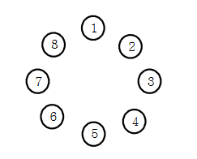

# 공주 구하기 (Queue)

정보 왕국의 이웃 나라 외동딸 공주가 숲속의 괴물에게 잡혀갔습니다.
정보 왕국에는 왕자가 N명이 있는데 서로 공주를 구하러 가겠다고 합니다. 정보왕국의 왕은 다음과 같은 방법으로 공주를 구하러 갈 왕자를 결정하기로 했습니다.


왕은 왕자들을 나이 순으로 1번부터 N번까지 차례로 번호를 매긴다. 그리고 1번 왕자부터 N번 왕자까지 순서대로 시계 방향으로 돌아가며 동그랗게 앉게 한다. 그리고 1번 왕자부터 시계방향으로 돌아가며 1부터 시작하여 번호를 외치게 한다. 한 왕자가 K(특정숫자)를 외치면 그 왕자는 공주를 구하러 가는데서 제외되고 원 밖으로 나오게 된다. 그리고 다음 왕자부터 다시 1부터 시작하여 번호를 외친다.
이렇게 해서 마지막까지 남은 왕자가 공주를 구하러 갈 수 있다.

예를 들어 총 8명의 왕자가 있고, 3을 외친 왕자가 제외된다고 하자. 처음에는 3번 왕자가 3을 외쳐 제외된다. 이어 6, 1, 5, 2, 8, 4번 왕자가 차례대로 제외되고 마지막까지 남게 된 7번 왕자에게 공주를 구하러갑니다.
N과 K가 주어질 때 공주를 구하러 갈 왕자의 번호를 출력하는 프로그램을 작성하시오.

### 입력설명

- 첫 줄에 자연수 N(5<=N<=1,000)과 K(2<=K<=9)가 주어진다.

### 출력설명

- 첫 줄에 마지막 남은 왕자의 번호를 출력합니다.

### 입력예제 1

- 8 3

### 출력예제 1

- 7

---

## 풀이

```js
function solution(n, k) {
  const arr = [];
  for (let i = 1; i < n + 1; i++) {
    arr.push(i);
  }
  while (arr.length > 1) {
    for (let i = 0; i < k; i++) {
      const [turn] = arr.splice(0, 1);
      if (i !== k - 1) {
        arr.push(turn);
      }
    }
  }
  return arr[0];
}

console.log(solution(8, 3));
```

- 재귀를 돌릴까 하다가 그냥 2중 loop문을 돌렸다.
- 환형 queue 구조를 만들기 위해 각 턴마다 배열의 맨 앞에서 제거 -> 다시 push 하는 과정으로 구현
  - 이 과정에서 shift() 를 쓸까 하다가 성능이 떨어진다는 이야기가 있어 splice를 썼는데 비슷한 것 같다.
- 시간 복잡도 O(n^2)

## 선생님 풀이

```js
const solution1 = (n, k) => {
  let answer;
  let queue = Array.from({ length: n }, (v, i) => ++i); // 1~8 까지 배열 생성

  while (queue.length) {
    for (let i = 1; i < k; i++) queue.push(queue.shift());
    queue.shift(); // k번째 요소 빼기
    if (queue.length === 1) answer = queue.shift();
  }
  return answer;
};

console.log(solution1(8, 3));
```

- Array.from 으로 배열을 생성하는 방법이 신기하다. 유사배열을 매개변수로 받는다.
- 난 if문으로 for문 내에서 복잡하게 구현했으나, 분기 처리 없이 흐름으로 구현
- 시간 복잡도 O(n)
