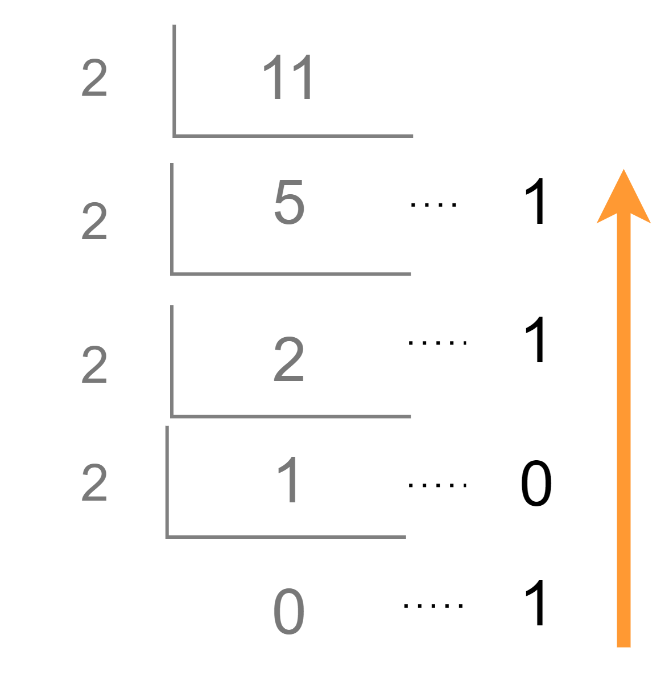

# 재귀함수를 이용한 이진수 출력 \*\*\*

10진수 N이 입력되면 2진수로 변환하여 출력하는 프로그램을 작성하세요. 단 재귀함수를 이용해서 출력해야 합니다.

### 입력설명

- 첫 번째 줄에 10진수 N(1<=N<=1,000)이 주어집니다.

### 출력설명

- 첫 번째 줄에 이진수를 출력하세요.

### 입력예제 1

- 11

### 출력예제 1

- 1011

---

## 풀이

```js
function solution(n) {
  const notation = 2; // 2진법: n진법이면 숫자만 바꾸면 됨

  const DFS = (L) => {
    const devided = Math.floor(L / notation); // 소수점 이하는 버린 나눈 몫
    const remainder = L % notation; // 나머지 값
    // console.log(L, devided, remainder);
    if (devided === 0) {
      return remainder;
    } else {
      return `${DFS(devided)}${remainder}`;
    }
  };

  return Number(DFS(n));
}

console.log(solution(11));
```

- 재귀 함수로 호출되는 DFS(깊이 우선 탐색) 함수 생성
- 2진수 변환하는 방법
  {: width="70%" height="70%"}
  - 10진수의 수를 2로 나눈 값이 0이 될 때까지 나눈다.
  - 위 과정에서의 나머지 값을 거꾸로 붙이면 진수 변환 완성

- 재귀 함수 생성
  - 숫자를 인자로 받아 2로 나눈 나머지 값을 반환
  - 인자로 받은 숫자를 2로 나눈 값이 0일 경우(소수점 버림), 재귀 호출 멈춤

### 선생님 풀이

```js
function solution1(n) {
  let answer = ''; // 재귀 함수 상위 스코프에 변수 생성
  const DFS = (n) => {
    if (n === 0) return;
    else {
      DFS(parseInt(n / 2));
      answer += n % 2;
    }
  };
  DFS(n);

  return answer;
}

console.log(solution1(11));
```

- 재귀 함수 자체가 값을 반환하는 방법이 아닌, 재귀 함수 내에서 바깥 스코프의 변수에 접근해서 재할당하는 방법으로 구현

