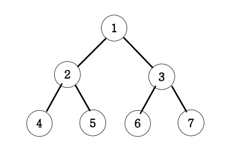

# 이진트리 순회(DFS_깊이 우선 탐색)

### 문제 설명

- 아래 그림과 같은 이진트리의 전위순회와 후회순회를 연습해보세요.

{: height: 70%, width: 70%}

### 출력 예시
- 전위순회 출력
  - 1 2 4 5 3 6 7
- 중위순회 출력
  - 4 2 5 1 6 3 7
- 후회순회 출력
  - 4 5 2 6 7 3 1

---

## 풀이

```js
/**
 * @param n : 트리의 root 인덱스
 * @returns {string}
 */
function solution(n) {
  let answer = "";

  const DFS = (v) => {
    if (v > 7) {
      return;
    } else {
      console.log(v); // 전위 순회
      DFS(v * 2); // 왼쪽 자식 방향
      // console.log(v); // 중위 순회
      DFS(v * 2 + 1); // 오른쪽 자식 방향
      // console.log(v); // 후위 순회
    }
  };

  DFS(n);

  return answer;
}

console.log(solution(1));
```

- 이진 트리
  - 이진 트리의 인덱스
    - 왼쪽 자식: 부모 * 2
    - 오른쪽 자식: 부모 * 2 + 1

  - 순회 방법(기준: 부모)
    - 전위순회: 부모 -> 왼쪽 자식 -> 오른쪽 자식
    - 중위순회: 왼쪽 자식 -> 부모 -> 오른쪽 자식
    - 후위순회: 왼쪽 자식 -> 오른쪽 자식 -> 부모


### 선생님 풀이

```js

```


