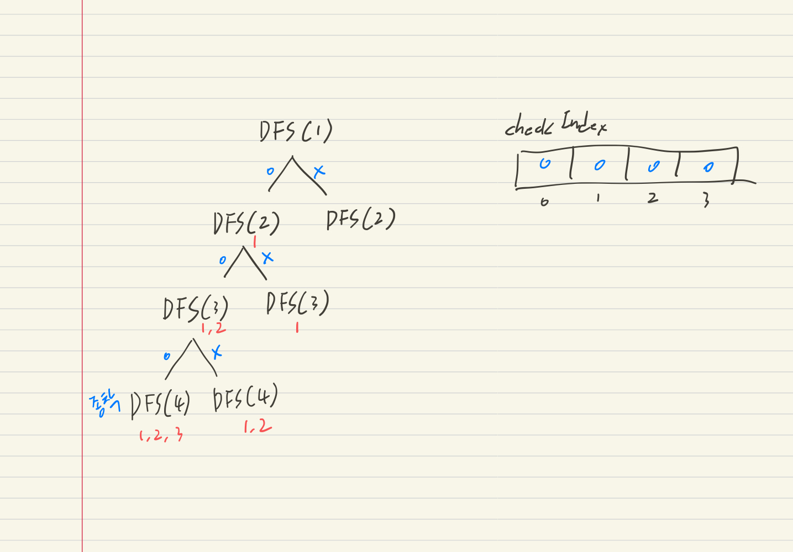

# 부분집합 구하기(DFS)

- 자연수 N이 주어지면 1부터 N까지의 원소를 갖는 집합의 부분집합을 모두 출력하는 프로그램 을 작성하세요.

### 입력설명

- 첫 번째 줄에 자연수 N(1<=N<=10)이 주어집니다.

### 출력설명

- 첫 번째 줄부터 각 줄에 하나씩 부분집합을 아래와 출력예제와 같은 순서로 출력한다. 단 공집합은 출력하지 않습니다.

### 입력예제 1

- 3

### 출력예제 1

- 1 2 3
- 1 2
- 1 3
- 1
- 2 3
- 2
- 3

---

## 풀이

```js
function solution(n) {
    let answer = [];

    // check 배열: 0, 1로 부분집합에 포함할 것인지 여부를 체크하는 배열
    const checkIndex = Array.from({length: n + 1}, () => 0);
    const DFS = (v) => {
        // depth n일 경우: 종착
        if (v === n + 1) {
            console.log(checkIndex);
            // checkIndex의 포함여부에 따라서 배열로 만든 후, 결과로 취합
            const result = [];
            for (let i = 1; i <= n; i++) {
                if (checkIndex[i] === 1) result.push(i);
            }
            if (result.length > 0) {
                answer.push(result);
            }
        } else {
            // 현재 depth의 포함 여부 세팅해서 이진트리로 DFS
            checkIndex[v] = 1;
            DFS(v + 1);
            checkIndex[v] = 0;
            DFS(v + 1);
        }
    };
    DFS(1);
    return answer;
}

console.log(solution(3));
```

- 이진트리로 해결
  {: width: 70%, height: 70%}


- 이진트리 분기 기준
    - 현재 depth의 숫자를 부분집합에 포함시킬 것인지, 아닌지
    - 포함 여부는 checkIndex 배열을 만들어 0과 1로 포함 여부 플래그 처리
- 재귀함수 종착 기준
    - 타겟 숫자의 depth보다 한 depth 더 깊이 들어갔을 때, 재귀를 멈추고 포함 여부 종합
    - checkIndex 배열에서 값이 1인 경우 => 부분 집합에 포함
